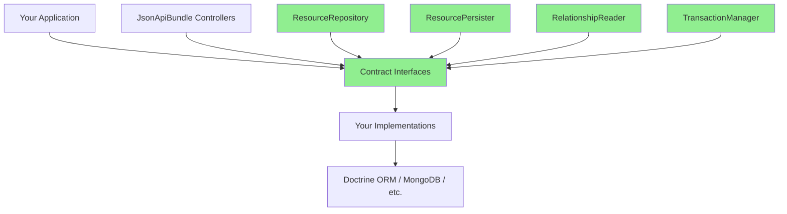

# Public API Reference

**Version**: 0.1.0  
**Status**: Stable  
**Last Updated**: 2025-10-07

---

## Overview

This document defines the **stable public API** of JsonApiBundle. All interfaces and classes listed here follow [Semantic Versioning](https://semver.org/) and are guaranteed to maintain backward compatibility within the same major version.

**Public API consists of**:
- All interfaces in `src/Contract/` namespace
- All attributes in `src/Resource/Attribute/` namespace
- Configuration schema in `Configuration.php`

**What is NOT public API**:
- All classes in `src/Http/Controller/` (internal implementation)
- All classes in `src/Bridge/Symfony/` (internal Symfony integration)
- Any class/interface not explicitly marked with `@api` tag

---

## Table of Contents

1. [Data Layer Contracts](#data-layer-contracts)
   - [ResourceRepository](#resourcerepository)
   - [ResourcePersister](#resourcepersister)
   - [RelationshipReader](#relationshipreader)
   - [RelationshipUpdater](#relationshipupdater)
   - [ExistenceChecker](#existencechecker)
2. [Data Transfer Objects](#data-transfer-objects)
   - [ChangeSet](#changeset)
   - [ResourceIdentifier](#resourceidentifier)
   - [Slice](#slice)
   - [SliceIds](#sliceids)
3. [Resource Metadata](#resource-metadata)
   - [ResourceMetadataInterface](#resourcemetadatainterface)
4. [Transaction Management](#transaction-management)
   - [TransactionManager](#transactionmanager)
5. [Resource Attributes](#resource-attributes)
   - [JsonApiResource](#jsonapiresource)
   - [Id](#id)
   - [Attribute](#attribute)
   - [Relationship](#relationship)
6. [Integration Examples](#integration-examples)

---

## Data Layer Contracts

### ResourceRepository

**Namespace**: `AlexFigures\Symfony\Contract\Data\ResourceRepository`  
**Purpose**: Read JSON:API resources and collections from your data layer  
**Stability**: `@api` - Stable since 0.1.0

**Interface**:
```php
interface ResourceRepository
{
    public function findCollection(string $type, Criteria $criteria): Slice;
    public function findOne(string $type, string $id, Criteria $criteria): ?object;
    public function findRelated(string $type, string $relationship, array $identifiers): iterable;
}
```

**When to use**: Implement this interface to integrate JsonApiBundle with your data source (Doctrine ORM, MongoDB, Elasticsearch, etc.).

**Example - Doctrine ORM**:
```php
use AlexFigures\Symfony\Contract\Data\ResourceRepository;
use AlexFigures\Symfony\Contract\Data\Slice;
use AlexFigures\Symfony\Query\Criteria;
use Doctrine\ORM\EntityManagerInterface;

final class DoctrineArticleRepository implements ResourceRepository
{
    public function __construct(
        private EntityManagerInterface $em,
    ) {}

    public function findCollection(string $type, Criteria $criteria): Slice
    {
        $qb = $this->em->createQueryBuilder()
            ->select('a')
            ->from(Article::class, 'a');

        // Apply filters, sorting, pagination from $criteria
        $query = $qb->getQuery();
        $query->setFirstResult(($criteria->pagination->number - 1) * $criteria->pagination->size);
        $query->setMaxResults($criteria->pagination->size);

        $items = $query->getResult();
        $total = $this->countTotal($qb);

        return new Slice(
            items: $items,
            pageNumber: $criteria->pagination->number,
            pageSize: $criteria->pagination->size,
            totalItems: $total,
        );
    }

    public function findOne(string $type, string $id, Criteria $criteria): ?object
    {
        return $this->em->find(Article::class, $id);
    }

    public function findRelated(string $type, string $relationship, array $identifiers): iterable
    {
        // Load related resources based on identifiers
        $ids = array_map(fn($id) => $id->id, $identifiers);
        return $this->em->getRepository(Author::class)->findBy(['id' => $ids]);
    }
}
```

---

### ResourcePersister

**Namespace**: `AlexFigures\Symfony\Contract\Data\ResourcePersister`  
**Purpose**: Create, update, and delete JSON:API resources  
**Stability**: `@api` - Stable since 0.1.0

**Interface**:
```php
interface ResourcePersister
{
    public function create(string $type, ChangeSet $changes, ?string $clientId = null): object;
    public function update(string $type, string $id, ChangeSet $changes): object;
    public function delete(string $type, string $id): void;
}
```

**When to use**: Implement this interface to handle write operations (POST, PATCH, DELETE) in your data layer.

**Example - Doctrine ORM**:
```php
use AlexFigures\Symfony\Contract\Data\ResourcePersister;
use AlexFigures\Symfony\Contract\Data\ChangeSet;
use AlexFigures\Symfony\Http\Exception\ConflictException;
use AlexFigures\Symfony\Http\Exception\NotFoundException;
use Doctrine\ORM\EntityManagerInterface;
use Symfony\Component\Uid\Uuid;

final class DoctrineArticlePersister implements ResourcePersister
{
    public function __construct(
        private EntityManagerInterface $em,
    ) {}

    public function create(string $type, ChangeSet $changes, ?string $clientId = null): object
    {
        if ($clientId !== null && $this->em->find(Article::class, $clientId)) {
            throw new ConflictException("Resource with ID {$clientId} already exists");
        }

        $article = new Article();
        $article->id = $clientId ?? Uuid::v4()->toString();
        
        foreach ($changes->attributes as $key => $value) {
            $article->$key = $value;
        }

        $this->em->persist($article);
        $this->em->flush();

        return $article;
    }

    public function update(string $type, string $id, ChangeSet $changes): object
    {
        $article = $this->em->find(Article::class, $id);
        if ($article === null) {
            throw new NotFoundException("Resource {$type}:{$id} not found");
        }

        foreach ($changes->attributes as $key => $value) {
            $article->$key = $value;
        }

        $this->em->flush();

        return $article;
    }

    public function delete(string $type, string $id): void
    {
        $article = $this->em->find(Article::class, $id);
        if ($article === null) {
            throw new NotFoundException("Resource {$type}:{$id} not found");
        }

        $this->em->remove($article);
        $this->em->flush();
    }
}
```

---

### RelationshipReader

**Namespace**: `AlexFigures\Symfony\Contract\Data\RelationshipReader`  
**Purpose**: Read relationship data and related resources  
**Stability**: `@api` - Stable since 0.1.0

**Interface**:
```php
interface RelationshipReader
{
    public function getToOneId(string $type, string $id, string $rel): ?string;
    public function getToManyIds(string $type, string $id, string $rel, Pagination $pagination): SliceIds;
    public function getRelatedResource(string $type, string $id, string $rel): ?object;
    public function getRelatedCollection(string $type, string $id, string $rel, Criteria $criteria): Slice;
}
```

**When to use**: Implement this interface to support relationship endpoints (`GET /articles/1/relationships/author`, `GET /articles/1/author`).

**Example**:
```php
use AlexFigures\Symfony\Contract\Data\RelationshipReader;
use AlexFigures\Symfony\Contract\Data\Slice;
use AlexFigures\Symfony\Contract\Data\SliceIds;

final class DoctrineRelationshipReader implements RelationshipReader
{
    public function getToOneId(string $type, string $id, string $rel): ?string
    {
        $article = $this->em->find(Article::class, $id);
        return $article?->author?->id;
    }

    public function getToManyIds(string $type, string $id, string $rel, Pagination $pagination): SliceIds
    {
        $article = $this->em->find(Article::class, $id);
        $comments = array_slice($article->comments, 
            ($pagination->number - 1) * $pagination->size, 
            $pagination->size
        );
        
        return new SliceIds(
            ids: array_map(fn($c) => $c->id, $comments),
            pageNumber: $pagination->number,
            pageSize: $pagination->size,
            totalItems: count($article->comments),
        );
    }

    public function getRelatedResource(string $type, string $id, string $rel): ?object
    {
        $article = $this->em->find(Article::class, $id);
        return $article?->author;
    }

    public function getRelatedCollection(string $type, string $id, string $rel, Criteria $criteria): Slice
    {
        // Similar to getToManyIds but returns full objects
        // ...
    }
}
```

---

### RelationshipUpdater

**Namespace**: `AlexFigures\Symfony\Contract\Data\RelationshipUpdater`  
**Purpose**: Update relationships between resources  
**Stability**: `@api` - Stable since 0.1.0

**Interface**:
```php
interface RelationshipUpdater
{
    public function replaceToOne(string $type, string $id, string $rel, ?ResourceIdentifier $target): void;
    public function replaceToMany(string $type, string $id, string $rel, array $targets): void;
    public function addToMany(string $type, string $id, string $rel, array $targets): void;
    public function removeFromToMany(string $type, string $id, string $rel, array $targets): void;
}
```

**When to use**: Implement this interface to support relationship modification endpoints (PATCH/POST/DELETE on `/articles/1/relationships/tags`).

---

### ExistenceChecker

**Namespace**: `AlexFigures\Symfony\Contract\Data\ExistenceChecker`  
**Purpose**: Check if a resource exists without loading it  
**Stability**: `@api` - Stable since 0.1.0

**Interface**:
```php
interface ExistenceChecker
{
    public function exists(string $type, string $id): bool;
}
```

**When to use**: Implement this interface for efficient existence checks (e.g., validating relationship targets).

**Example**:
```php
final class DoctrineExistenceChecker implements ExistenceChecker
{
    public function exists(string $type, string $id): bool
    {
        $class = $this->getClassForType($type);
        $count = $this->em->createQueryBuilder()
            ->select('COUNT(e.id)')
            ->from($class, 'e')
            ->where('e.id = :id')
            ->setParameter('id', $id)
            ->getQuery()
            ->getSingleScalarResult();
        
        return $count > 0;
    }
}
```

---

## Data Transfer Objects

### ChangeSet

**Namespace**: `AlexFigures\Symfony\Contract\Data\ChangeSet`  
**Purpose**: Represents attribute changes for create/update operations  
**Stability**: `@api` - Stable since 0.1.0

**Class**:
```php
final class ChangeSet
{
    public function __construct(
        public array $attributes = []
    ) {}
}
```

**Usage**: Passed to `ResourcePersister::create()` and `ResourcePersister::update()` containing the attributes to be written.

---

### ResourceIdentifier

**Namespace**: `AlexFigures\Symfony\Contract\Data\ResourceIdentifier`  
**Purpose**: Represents a JSON:API resource identifier (`{type, id}`)  
**Stability**: `@api` - Stable since 0.1.0

**Class**:
```php
final class ResourceIdentifier
{
    public function __construct(
        public string $type,
        public string $id,
    ) {}
}
```

---

### Slice

**Namespace**: `AlexFigures\Symfony\Contract\Data\Slice`  
**Purpose**: Represents a paginated collection of resources  
**Stability**: `@api` - Stable since 0.1.0

**Class**:
```php
final class Slice
{
    public function __construct(
        public array $items,        // list<object>
        public int $pageNumber,
        public int $pageSize,
        public int $totalItems,
    ) {}
}
```

---

### SliceIds

**Namespace**: `AlexFigures\Symfony\Contract\Data\SliceIds`  
**Purpose**: Represents a paginated collection of resource IDs  
**Stability**: `@api` - Stable since 0.1.0

**Class**:
```php
final class SliceIds
{
    public function __construct(
        public array $ids,          // list<string>
        public int $pageNumber,
        public int $pageSize,
        public int $totalItems,
    ) {}
}
```

---

## Resource Metadata

### ResourceMetadataInterface

**Namespace**: `AlexFigures\Symfony\Contract\Resource\ResourceMetadataInterface`  
**Purpose**: Provides metadata about a resource type  
**Stability**: `@api` - Stable since 0.1.0

**Interface**:
```php
interface ResourceMetadataInterface
{
    public function getType(): string;
}
```

**When to use**: Rarely implemented directly. The bundle provides a default implementation based on `#[JsonApiResource]` attributes.

---

## Transaction Management

### TransactionManager

**Namespace**: `AlexFigures\Symfony\Contract\Tx\TransactionManager`  
**Purpose**: Manage database transactions for write operations  
**Stability**: `@api` - Stable since 0.1.0

**Interface**:
```php
interface TransactionManager
{
    /**
     * @template T
     * @param callable():T $callback
     * @return T
     */
    public function transactional(callable $callback);
}
```

**When to use**: Implement this interface to wrap write operations in database transactions.

**Example - Doctrine ORM**:
```php
use AlexFigures\Symfony\Contract\Tx\TransactionManager;
use Doctrine\ORM\EntityManagerInterface;

final class DoctrineTransactionManager implements TransactionManager
{
    public function __construct(
        private EntityManagerInterface $em,
    ) {}

    public function transactional(callable $callback)
    {
        return $this->em->transactional($callback);
    }
}
```

---

## Resource Attributes

### JsonApiResource

**Namespace**: `AlexFigures\Symfony\Resource\Attribute\JsonApiResource`  
**Purpose**: Mark a PHP class as a JSON:API resource  
**Stability**: `@api` - Stable since 0.1.0

**Attribute**:
```php
#[Attribute(Attribute::TARGET_CLASS)]
final class JsonApiResource
{
    public function __construct(
        public readonly string $type,
        public readonly ?string $routePrefix = null,
        public readonly ?string $description = null,
        public readonly bool $exposeId = true,
    ) {}
}
```

**Example**:
```php
use AlexFigures\Symfony\Resource\Attribute\JsonApiResource;

#[JsonApiResource(
    type: 'articles',
    routePrefix: '/api',
    description: 'Blog articles',
    exposeId: true
)]
final class Article
{
    // ...
}
```

---

### Id

**Namespace**: `AlexFigures\Symfony\Resource\Attribute\Id`  
**Purpose**: Mark a property/method as the resource identifier  
**Stability**: `@api` - Stable since 0.1.0

**Example**:
```php
use AlexFigures\Symfony\Resource\Attribute\Id;

#[JsonApiResource(type: 'articles')]
final class Article
{
    #[Id]
    public string $id;
}
```

---

### Attribute

**Namespace**: `AlexFigures\Symfony\Resource\Attribute\Attribute`  
**Purpose**: Mark a property/method as a JSON:API attribute  
**Stability**: `@api` - Stable since 0.1.0

**Attribute**:
```php
#[Attribute(Attribute::TARGET_PROPERTY | Attribute::TARGET_METHOD)]
final class Attribute
{
    public function __construct(
        public readonly ?string $name = null,
        public readonly bool $readable = true,
        public readonly bool $writable = true,
    ) {}
}
```

**Example**:
```php
use AlexFigures\Symfony\Resource\Attribute\Attribute;

#[JsonApiResource(type: 'articles')]
final class Article
{
    #[Attribute(name: 'title', readable: true, writable: true)]
    public string $title;

    #[Attribute(readable: true, writable: false)]
    public \DateTimeImmutable $createdAt;
}
```

---

### Relationship

**Namespace**: `AlexFigures\Symfony\Resource\Attribute\Relationship`  
**Purpose**: Mark a property/method as a JSON:API relationship  
**Stability**: `@api` - Stable since 0.1.0

**Attribute**:
```php
#[Attribute(Attribute::TARGET_PROPERTY | Attribute::TARGET_METHOD)]
final class Relationship
{
    public function __construct(
        public readonly bool $toMany = false,
        public readonly ?string $inverse = null,
        public readonly ?string $targetType = null,
    ) {}
}
```

**Example**:
```php
use AlexFigures\Symfony\Resource\Attribute\Relationship;

#[JsonApiResource(type: 'articles')]
final class Article
{
    #[Relationship(toMany: false, targetType: 'authors')]
    public ?Author $author = null;

    #[Relationship(toMany: true, targetType: 'comments')]
    public array $comments = [];
}
```

---

## Integration Examples

### Complete Doctrine ORM Integration

See the examples above for individual interfaces. A complete integration would implement:

1. `ResourceRepository` - for reading resources
2. `ResourcePersister` - for writing resources
3. `RelationshipReader` - for reading relationships
4. `RelationshipUpdater` - for updating relationships
5. `ExistenceChecker` - for existence checks
6. `TransactionManager` - for transaction management

Register these services in your Symfony container:

```yaml
# config/services.yaml
services:
    App\JsonApi\DoctrineArticleRepository:
        tags:
            - { name: 'jsonapi.repository', type: 'articles' }

    App\JsonApi\DoctrineArticlePersister:
        tags:
            - { name: 'jsonapi.persister', type: 'articles' }

    # ... other services
```

---

## Dependency Diagram



**Legend**:
- 🟢 Green = Public API (stable, BC guaranteed)
- ⚪ White = Your code (application-specific)

---

## See Also

- [Backward Compatibility Policy](bc-policy.md) - BC guarantees and versioning
- [Upgrade Guide](upgrade-guide.md) - Migration between versions
- [JSON:API 1.1 Specification](https://jsonapi.org/format/1.1/) - Official spec

---

**Last Updated**: 2025-10-07  
**Maintainer**: JsonApiBundle Team

