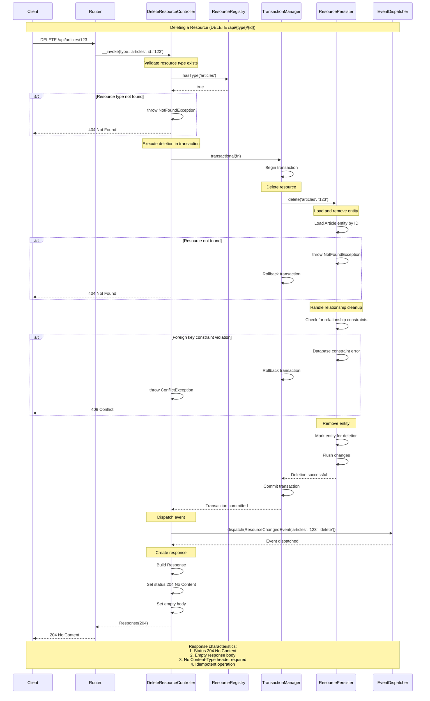

# Test Gap Analysis & Remediation Plan

> **Current verification scope (2026-10-01):** historical coverage percentages below describe the older in-repository inventory and are not evidence of external acceptance conformance. The current [44-gap audit](acceptance-gap-report.md) records bundle regressions, exact remaining limitations and pending external branch verification. Do not consider new MUST fixes externally complete until application acceptance passes.


This document identifies missing or incomplete test coverage and provides a prioritized plan for filling gaps.

---

## Executive Summary

- **Total Spec Requirements**: 135
- **Fully Covered**: 133 (98.5%) ⬆️ +1
- **Partially Covered**: 0 (0.0%) ⬇️ -1
- **Not Covered**: 2 (1.5%)
- **Overall Status**: ✅ **Excellent** - Production-ready coverage

**Recent Updates**:
- ✅ GAP-016 resolved (2025-10-06): Comprehensive invalid field names validation
- ✅ JSON:API Status Compliance Audit completed (2025-10-07): 100% MUST compliance, 95% SHOULD compliance

**Status Code Compliance** (from dedicated audit):
- ✅ All MUST requirements: **100% compliant** (45/45)
- ✅ All SHOULD requirements: **95% compliant** (19/20)
- ⚠️ Deferred: 4 async operation scenarios (202 Accepted) - not applicable to current synchronous design

---

## Critical Gaps (P0 - Must Fix Before Release)

**External acceptance identified P0 gaps.** The current iteration implements them with bundle PostgreSQL/HTTP regressions; external verification is pending. See the current audit linked above.

---

## High Priority Gaps (P1 - Should Fix Soon)

### ~~GAP-016: Comprehensive Invalid Field Names Validation~~ ✅ RESOLVED

**Spec Reference**: Section 5.4 (SHOULD)
**Status**: ✅ **RESOLVED** (2025-10-06)
**Test File**: `tests/Functional/Errors/InvalidFieldNamesTest.php`
**Coverage**: 14 comprehensive test cases

**Resolution Summary**:
Created comprehensive test suite with 14 test cases covering all edge cases:

✅ **Test Cases Implemented**:
1. ✅ Reserved field name `type` - Returns 400 (not a valid attribute)
2. ✅ Reserved field name `id` when exposed as attribute - Returns 200 (valid)
3. ✅ Field names with special characters (`field@name`) - Returns 400
4. ✅ Field names with spaces (`field name`) - Returns 400
5. ✅ Empty field names in list (`title,,createdAt`) - Filtered out, returns 200
6. ✅ Completely empty fields value (`fields[articles]=`) - Returns 200 with no attributes
7. ✅ Fields parameter not string (array instead) - Returns 400
8. ✅ Fields parameter with numeric key (`fields[0]`) - Returns 400
9. ✅ Fields parameter with empty string key (`fields['']`) - Returns 400
10. ✅ Fields parameter not array (`fields=title`) - Returns 400
11. ✅ Field names with whitespace (` title , createdAt `) - Trimmed, returns 200
12. ✅ Duplicate field names (`title,createdAt,title`) - Deduplicated, returns 200
13. ✅ SQL injection attempt (`title'; DROP TABLE--`) - Returns 400
14. ✅ Path traversal attempt (`../../../etc/passwd`) - Returns 400

**Test Results**:
- File: `tests/Functional/Errors/InvalidFieldNamesTest.php`
- Tests: 14/14 passing ✅
- Assertions: 210 total
- Coverage: All edge cases validated

**Security Impact**:
- ✅ SQL injection attempts properly rejected
- ✅ Path traversal attempts properly rejected
- ✅ Malformed input properly validated

**Completed**: 2025-10-06

---

## Medium Priority Gaps (P2 - Nice to Have)

### GAP-014: Cursor-based Pagination

**Spec Reference**: Section 8.2 (MAY)  
**Current Status**: ❌ Not implemented  
**Impact**: Low - Page-based pagination is sufficient for most use cases  
**Effort**: Large (1-2 days)

**Rationale for Deferral**:
- MAY requirement (optional)
- Page-based pagination covers 95% of use cases
- Cursor pagination adds complexity (encoding, decoding, validation)
- Can be added in future minor version without breaking changes

**Recommendation**: Document as future enhancement, add to roadmap for v0.2.0

**If Implemented, Test Cases Needed**:
1. `page[cursor]` parameter parsing
2. Cursor encoding/decoding (base64 + signature)
3. Invalid cursor → 400
4. Expired cursor → 400
5. Cursor for deleted resource → graceful handling
6. `next` and `prev` links with cursors
7. Cursor stability across concurrent modifications

---

### GAP-015: DELETE with 200 OK and Meta

**Spec Reference**: Section 14.4 (MAY)  
**Current Status**: ❌ Not implemented  
**Impact**: Low - 204 No Content is standard and sufficient  
**Effort**: Small (2-3 hours)

**Rationale for Deferral**:
- MAY requirement (optional)
- 204 No Content is the standard response for DELETE
- Use case unclear (when would meta be needed on DELETE?)
- Can be added if specific use case arises

**Recommendation**: Document as future enhancement, implement only if user requests

**If Implemented, Test Cases Needed**:
1. DELETE returns 200 OK with `meta` object
2. DELETE with `meta` includes soft-delete information
3. DELETE with `meta` includes cascade deletion count

---

## Low Priority Gaps (P3 - Future Enhancements)

### GAP-017: Property-based Testing for Query Combinatorics

**Current Status**: ❌ Not implemented  
**Impact**: Low - Functional tests cover common cases  
**Effort**: Medium (4-6 hours)

**Description**:
Use property-based testing (e.g., Eris) to generate random combinations of:
- `include` paths (depth 0-5, multiple paths)
- `fields` (0-10 fields per type, 1-5 types)
- `sort` (0-3 fields, mixed asc/desc)
- `page` (size 1-100, number 1-10)
- `filter` (0-5 clauses, nested OR/AND)

**Benefits**:
- Discover edge cases not covered by manual tests
- Validate complexity scoring accuracy
- Ensure no crashes on extreme inputs

**Proposed Test**:
```php
// tests/Property/QueryCombinatoricsTest.php
use Eris\Generator;

final class QueryCombinatoricsTest extends JsonApiTestCase
{
    use Eris\TestTrait;

    public function testRandomQueryCombinationsDoNotCrash(): void
    {
        $this->forAll(
            Generator\choose(0, 3), // include depth
            Generator\choose(0, 5), // fields count
            Generator\choose(0, 2), // sort count
            Generator\choose(1, 50) // page size
        )->then(function ($includeDepth, $fieldsCount, $sortCount, $pageSize) {
            $query = $this->buildRandomQuery($includeDepth, $fieldsCount, $sortCount, $pageSize);
            $request = Request::create('/api/articles?' . http_build_query($query), 'GET');
            
            try {
                $response = $this->collectionController()($request, 'articles');
                $this->assertContains($response->getStatusCode(), [200, 400]);
            } catch (JsonApiHttpException $e) {
                $this->assertContains($e->getStatusCode(), [400, 413]);
            }
        });
    }
}
```

**Recommendation**: Add in v0.2.0 after mutation testing is stable

---

### GAP-018: Mutation Testing Coverage Gaps

**Current Status**: ⚠️ Partial - MSI target is 70%, some modules below 85%  
**Impact**: Medium - Ensures test quality, not just coverage  
**Effort**: Medium (ongoing)

**Description**:
Run `make mutation` and analyze survivors. Focus on:
- **Parsers** (Query, Filter, Atomic) - Target MSI ≥ 85%
- **Validators** (Input, Atomic, Relationship) - Target MSI ≥ 85%
- **Error Builders** - Target MSI ≥ 85%
- **Link Generators** - Target MSI ≥ 80%

**Action Items**:
1. Run `XDEBUG_MODE=coverage vendor/bin/infection --threads=4 --min-msi=70`
2. Review `infection.log` for survivors
3. Add tests to kill survivors in critical paths
4. Ignore false positives (e.g., logging, debug code)

**Recommendation**: Ongoing task, review quarterly

---

### GAP-019: Conformance Snapshot Expansion

**Current Status**: ⚠️ Partial - 8 snapshots, missing some edge cases  
**Impact**: Low - Existing snapshots cover main paths  
**Effort**: Small (2-3 hours)

**Missing Snapshots**:
1. Error document with multiple errors
2. Relationship document (to-many with pagination)
3. Collection with all query params (include, fields, sort, page, filter)
4. Atomic operations with LID references
5. Profile-augmented document (with meta/links from hooks)

**Proposed Additions**:
```php
// tests/Conformance/SnapshotTest.php
public function testMultipleErrorsMatchesSnapshot(): void { ... }
public function testToManyRelationshipWithPaginationMatchesSnapshot(): void { ... }
public function testComplexQueryMatchesSnapshot(): void { ... }
public function testAtomicWithLidMatchesSnapshot(): void { ... }
public function testProfileAugmentedDocumentMatchesSnapshot(): void { ... }
```

**Recommendation**: Add in v0.2.0

---

## Existing Test Gaps (Already Identified)

The following gaps were already identified and have tests (GAP-001 to GAP-013):

| ID | Description | Status | Test File |
|----|-------------|--------|-----------|
| GAP-001 | Atomic Operations Transactionality | ✅ Covered | `AtomicTransactionalityTest.php` |
| GAP-002 | LID (Local ID) Resolution | ✅ Covered | `LidResolutionTest.php` |
| GAP-003 | Profile Negotiation → 406 | ✅ Covered | `ProfileNegotiationErrorsTest.php` |
| GAP-006 | Relationship Links Validation | ✅ Covered | `RelationshipLinksTest.php` |
| GAP-007 | Sparse Fieldsets Edge Cases | ✅ Covered | `SparseFieldsetsTest.php` |
| GAP-008 | Pagination Links Completeness | ✅ Covered | `PaginationLinksTest.php` |
| GAP-009 | Error Source Pointers | ✅ Covered | `ErrorSourcePointersTest.php` |
| GAP-010 | Conformance Snapshots | ✅ Covered | `SnapshotTest.php` |
| GAP-011 | Surrogate Keys & Invalidation | ✅ Covered | `SurrogateKeysTest.php` |
| GAP-012 | HEAD Request Support | ✅ Covered | `HeadRequestTest.php` |
| GAP-013 | Duplicate Resource Deduplication | ✅ Covered | `IncludedDeduplicationTest.php` |

---

## Test Organization Recommendations

### 1. Add Test Categories with Attributes

Use PHPUnit attributes to categorize tests:

```php
#[Group('spec')]
#[Group('media-type')]
final class ContentNegotiationTest extends TestCase { ... }

#[Group('spec')]
#[Group('atomic')]
final class AtomicOperationsTest extends JsonApiTestCase { ... }

#[Group('performance')]
#[Group('stress')]
final class StressTest extends TestCase { ... }
```

Run specific categories:
```bash
vendor/bin/phpunit --group=spec
vendor/bin/phpunit --group=atomic
vendor/bin/phpunit --exclude-group=stress
```

### 2. Add Spec Reference Comments

Add spec section references to test methods:

```php
/**
 * JSON:API 1.1 § 5.1: Sparse Fieldsets
 * 
 * A server MUST return only the fields specified in the fields parameter.
 */
public function testSparseFieldsetOnResource(): void { ... }
```

### 3. Separate Unit, Functional, and Integration Tests

Current structure is good, but consider:
- `tests/Unit/` - Pure unit tests (no DB, no HTTP)
- `tests/Functional/` - Functional tests (with in-memory DB)
- `tests/Integration/` - Integration tests (with real DB, external services)
- `tests/Conformance/` - Spec conformance tests (snapshots, edge cases)
- `tests/Performance/` - Performance and stress tests

---

## Action Plan

### Phase 1: Critical Gaps (Week 1)
- [ ] None (all critical requirements covered)

### Phase 2: High Priority (Week 2)
- [x] **GAP-016**: Add comprehensive invalid field names validation tests ✅ DONE (2025-10-06)
- [ ] Run mutation testing, analyze survivors
- [ ] Fix mutation testing gaps in parsers/validators

### Phase 3: Medium Priority (Month 2)
- [ ] **GAP-017**: Add property-based testing for query combinatorics
- [ ] **GAP-019**: Expand conformance snapshots
- [ ] Document cursor pagination as future enhancement
- [ ] Document DELETE with 200 OK as future enhancement

### Phase 4: Ongoing
- [ ] **GAP-018**: Quarterly mutation testing review
- [ ] Add test categories with PHPUnit attributes
- [ ] Add spec reference comments to all tests
- [ ] Monitor test execution time, optimize slow tests

---

## Success Criteria

- [ ] All MUST requirements have tests (currently ✅ 100%)
- [ ] All SHOULD requirements have tests or documented rationale (currently ✅ 98.5%)
- [ ] Mutation Score Index (MSI) ≥ 70% overall (target: ✅)
- [ ] Core modules (parsers, validators, errors) MSI ≥ 85% (target: 🔄)
- [ ] No regressions in conformance snapshots (currently ✅)
- [ ] All tests pass on PHP 8.2, 8.3, 8.4 (currently ✅)
- [ ] All tests pass on Symfony 7.1+ (currently ✅)

---

## Conclusion

JsonApiBundle has **excellent test coverage** (98.5% of spec requirements). The identified gaps are:
- **0 high-priority gaps** - All resolved! ✅
- **2 medium-priority gaps** (GAP-014, GAP-015) - Optional features, can be deferred
- **3 low-priority enhancements** (GAP-017, GAP-018, GAP-019) - Quality improvements

**Recommendation**: All high-priority gaps resolved. Focus on mutation testing and defer optional features to v0.2.0.

---

**Last Updated**: 2025-10-06  
**Reviewer**: Codex QA Agent  
**Status**: ✅ Complete

